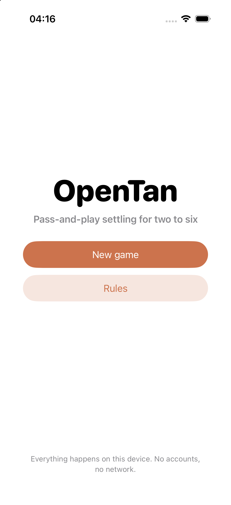
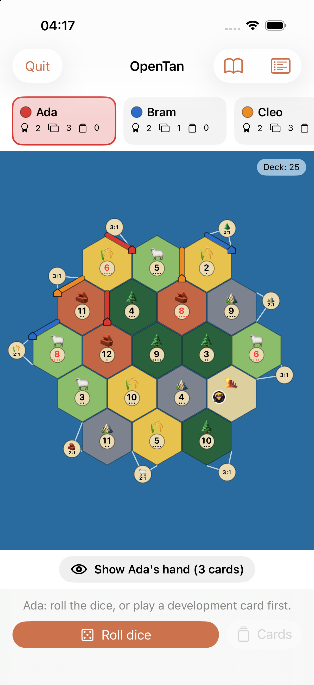

# OpenTan

An open source pass-and-play strategy board game for iPhone and iPad. Two to six
people share one device: you roll, build roads and settlements, trade resources,
move the robber and race to the victory point target. There is no account, no
server and no network code of any kind.

<p align="center">
  
  
</p>

## Playing

1. **New game** — name two to six players and pick the board and any house rules.
2. **Opening placement** — in seating order each player places a settlement and a
   road, then the order reverses for a second settlement and road. The second
   settlement pays out the tiles around it straight away.
3. **A turn** — roll the dice, everybody collects from tiles showing that number,
   then build, trade and play a development card in any order before ending your
   turn.
4. **The device is covered between players**, so nobody sees anybody else's hand.
   Tap the hand bar to hide your own cards again before you pass it on.

The full rules summary is in the app under the book icon, and in
[docs/RULES.md](docs/RULES.md).

## What is implemented

- The 19-tile board for two to four players and the 30-tile board for five or six.
- Random board generation, with an option to keep the 6 and 8 tiles apart.
- Nine ports on the small board and eleven on the large one, spread around the
  coast: 2:1 for each resource and the rest 3:1.
- Opening placement there and back, including the payout for the second settlement.
- Production, including the rule that nobody collects a resource the bank cannot
  pay out in full to more than one player.
- The robber: discarding half your hand above the limit, moving the robber and
  stealing one random card.
- Roads, settlements, cities, the distance rule and the road connection rule.
- The full development deck: knights, road building, year of plenty, monopoly and
  victory points, with one card per turn and none on the turn it was bought.
- Trading with the bank, at a port, and with another player at the table.
- Longest road (five segments, broken by an opponent's building) and largest army
  (three knights), both keeping the card with the holder on a tie.
- Victory points revealed on your own turn, with a configurable target.
- The special build phase for five and six players.
- Games are saved automatically and survive the app being closed.

House rules you can change when starting a game: the victory point target, the
hand size that forces a discard, whether 6 and 8 may touch, the board size and
whether the special build phase is used.

## Building

Requires Xcode 16 or newer and an iOS 17 deployment target.

```sh
brew install xcodegen      # once
xcodegen generate          # writes OpenTan.xcodeproj from project.yml
open OpenTan.xcodeproj
```

The Xcode project is generated and is not checked in; `project.yml` is the source
of truth.

## Tests

The rules engine is a plain Swift package with no UI, so it tests quickly on the
command line:

```sh
cd Engine && swift test
```

The app has a small XCUITest suite that drives the real board:

```sh
xcodebuild test -project OpenTan.xcodeproj -scheme OpenTan \
  -destination 'platform=iOS Simulator,name=iPhone 17'
```

Launching with `--demo-game` opens a three player game with the opening placement
already made, and `--demo-setup` opens a fresh game on the first placement. Both
are for screenshots and tests; neither is reachable from the app itself.

## How the code is laid out

```
Engine/Sources/OpenTanEngine   the rules, with no UI and no platform code
  Hex.swift                    board geometry: hexes, corners and edges
  Board.swift                  tiles, ports and board generation
  Player.swift                 hands, development cards, costs and supplies
  Placement.swift              where you may build, longest road, trade rates
  GameState.swift              phases, actions and everything that mutates
App/Sources                    the SwiftUI app
  GameStore.swift              holds the game, saves it, decides whose turn it is
  Views/BoardView.swift        draws the board and turns taps into placements
```

A corner of the board is identified by the three tiles that meet at it and an
edge by the two that share it, so corners and edges shared between tiles compare
equal without any floating point rounding. Everything else in the geometry falls
out of that.

## Contributing

Pull requests are welcome. See [CONTRIBUTING.md](CONTRIBUTING.md). Rule changes
should come with a test in `Engine/Tests`.

## Licence

[MIT](LICENSE).

## A note on the original game

OpenTan is an independent, unofficial implementation of the classic
trading-and-building board game's public rules. It is not affiliated with,
endorsed by or connected to CATAN GmbH, Asmodee or any of their subsidiaries, and
it ships none of their artwork, text or trademarks. Game rules themselves are not
copyrightable; the names and artwork are, so OpenTan uses neither. If you want the
original game with its own board and components, buy it.
